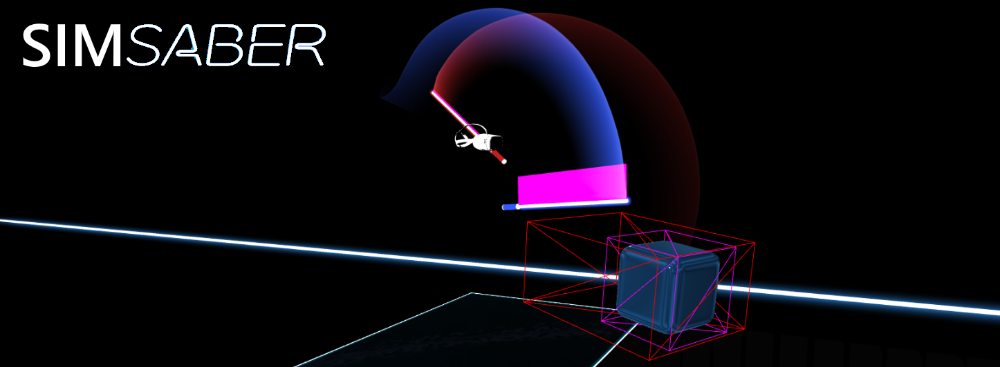
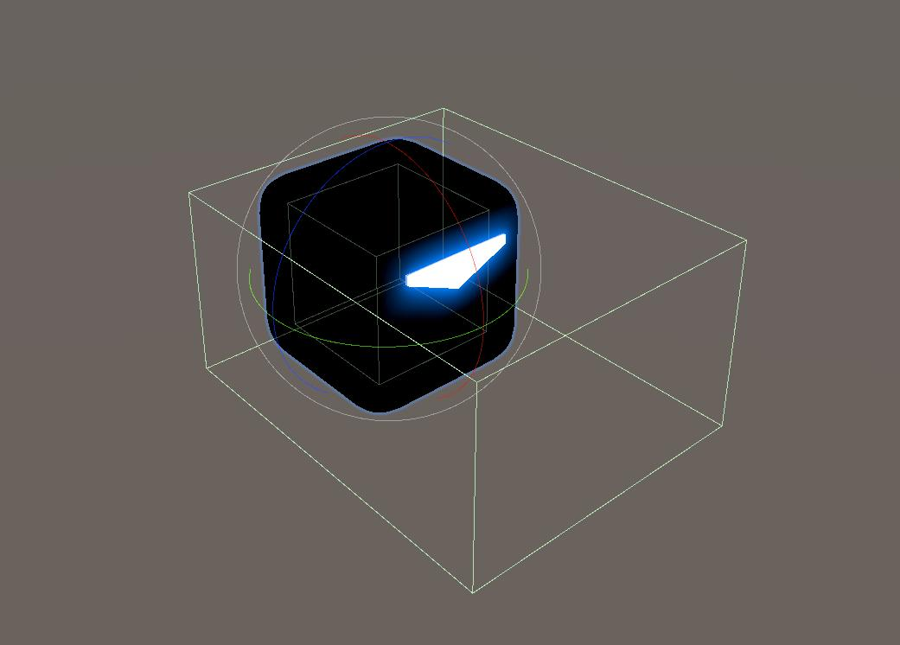
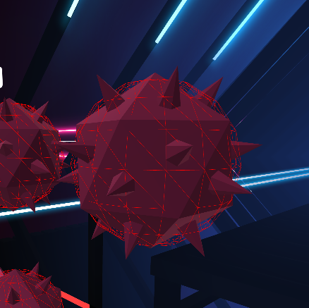

**SimSaber: Python-based Beat Saber replay simulator and scoring validator**

## Beat Saber Scoring

Here, we discuss the basics of Beat Saber's score calculation algorithms. These details were primarily discovered by directly reverse engineering the game's source code, with some help from the [BeatLeader](https://www.beatleader.xyz/) and [BSMG](https://bsmg.wiki/) communities.

### Overview
The score of a note is broken down by before swing (70 points), after swing (30 points), and accuracy (15 points). The before swing rating and after swing rating are both values between 0 and 1 which are the fraction of their respective total possible points (70 and 30). Each note calculates swing rating independently. On the frame on which the saber first crosses the center of the note, the game calculates the before cut rating from the previous recorded saber positions, and also knows to start calculating the after cut rating.

### Note Hitboxes

There are two box colliders for Beat Saber blocks; the bigger one (bigger than the visible cube) can detect only the good cuts. The smaller one (smaller than the cube itself) is for bad cuts only. We can't find the hitbox sizes in the game code; the actual hitboxes are encoded into game assets together with the models. The BeatLeader team did us a favor and built mods to discover the hitbox sizes. From this, we know that (excluding all modifiers):

- Arrow "good cut" hitbox is always:
  - Size: 0.8 x 0.5 x 1.0 box
  - Centered at: 0, 0, -0.25 relative to the note model
- Dot note "good cut" hitbox is always:
  - Size 0.8 x 0.8 x 1.0 box
  - Centered at 0, 0, -0.25 relative to the note model
- All notes "bad cut" hitbox is always:
  - Size: 0.4 x 0.4 x 0.4 box
  - Centered at 0, 0, 0 relative to the note model

### Bomb Hitboxes

The bomb hitbox is a sphere of radius 0.18, centered at 0, 0, 0 relative to the bomb model. Interestingly, this means that the bomb’s hitbox is smaller than the spikes on the bomb model, which can be clipped by the saber tip without actually triggering the bomb.

### Determining Cut Frame
To determine the frame on which the saber first crosses the center of note, the game calculates a ‘note plane,’ and then checks whether the tip of the saber from the current frame and from the previous frame are on different sides of the note plane. The cut plane is centered at the center of the note, and its normal vector is calculated as the cross product of the note’s forward vector, and the normal vector of the saber’s cut plane. In other words, this plane has one axis in the forward direction of the note, and is rotated so that the direction that the saber is cutting in is orthogonal to the plane. 

### Interpolated Saber Position
Once it is determined that the saber has hit the center of the note, the game calculates an interpolated position for where the saber was when it was exactly at the center. The hilt of this interpolated saber position is placed at the average of the hilts of the saber positions directly before and after the cut. The tip of the interpolated center is defined to be the intersection of the ray from the prevSaber’s tip to the currSaber’s tip with the note plane (described in the previous section). 

### Before Cut Rating
First, the game calculates the angle between the frame before the cut and the interpolated saber. Then, the game iterates backwards through the frames and adds to this value the angle differences between successive frames. It stops iteration on one of two conditions:

- The frame being considered happened more than 0.4 seconds ago
- The angle between the cut plane normal of the saber right after the cut and that of the frame being considered is more than 90°.

The latter condition basically states that if the direction that the saber was swinging in was different from the direction of the saber at the moment of the cut by more than 90o, then it is no longer considered part of the same swing. Furthermore, if this angle is between 75o and 90o, then instead of adding just the raw angle, it starts to linearly interpolate between adding the full angle and adding nothing.

### After Cut Rating
This is calculated essentially the same way as the before cut rating, except that it has to wait to actually receive the new frames, and so the after cut rating is updated with each frame. In the same way as the before cut rating, new frames are no longer considered after 0.4 seconds, or if the saber’s cut angle deviates by more than 90°. 

_Copyright &copy;2023 -- License [MIT](https://github.com/metaguard/simsaber/blob/main/LICENSE)_
